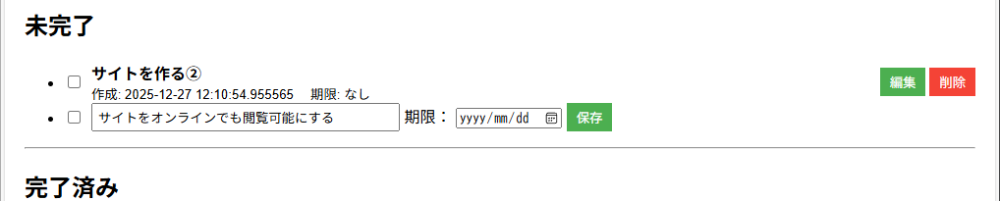

# タスク管理アプリ

## 概要
Python と Flask、PostgreSQL を使ったタスク管理アプリです。
タスクの追加・編集・削除・完了切替に加え、期限の設定・編集や並び替え機能を備えています。

未完了タスクと完了済みタスクは一覧で分かれて表示され、
チェックボックスやタスク行クリックで完了状態を切り替えることができます。
完了済みタスクは視覚的に区別できるよう、薄く表示されるUIを実装しています。

Render にデプロイしており、ブラウザからすぐに動作確認が可能です。

## デプロイURL（公開中）

▶ **https://flask-task-app-j6za.onrender.com**

## 実装した機能一覧

- タスクの追加
  - タイトルと期限（任意）を入力してタスクを登録可能
- タスクの一覧表示
  - 未完了タスクと完了済みタスクを分けて表示
- タスクの完了・未完了切り替え
  - チェックボックス、またはタスク行クリックで切り替え可能
- タスクの編集
  - タイトルと期限を後から編集可能
- タスクの削除
  - 不要なタスクを削除可能
- 並び替え機能
  - 作成日（新しい順／古い順）
  - 期限が近い順／遠い順
- UI 表示の工夫
  - 完了済みタスクは薄く表示
  - 編集・削除ボタンを右側に配置し視認性を向上
  - 未完了と完了済みの区切りを明確化

## スクリーンショット

### タスク一覧（未完了 / 完了済み）

- 未完了タスクと完了済みタスクを分けて表示
- チェックボックスや行クリックで完了状態を切り替え可能
- 完了済みタスクは薄く表示されるUI

### タスク編集

- タスク名と期限を後から編集可能

## 使い方
- ①デプロイ版（オンライン）の場合

以下のURLにアクセスすると、すぐにアプリを利用できます。
https://flask-task-app-j6za.onrender.com

- ②ローカル実行の場合 

1.Python をインストール 

2.リポジトリをクローン

  - git clone https://github.com/kyohei0014/flask-task-app.git
  - cd flask-task-app

3.依存関係をインストール

  - pip install -r requirements.txt

4.PostgreSQL の接続情報を環境変数 DATABASE_URL に設定

5.アプリを起動

  - python app.py

6.ブラウザで http://127.0.0.1:5000 にアクセス

## 学んだこと・工夫した点
- Flask を用いたWebアプリケーションの基本構造（ルーティング、テンプレート、DB接続）の理解 PostgreSQL を利用したデータベース設計と、Render 上での本番環境向け設定（DATABASE_URL の利用）
- psycopg2 を用いた CRUD（作成・読み取り・更新・削除）処理の実装
- SQLite から PostgreSQL への移行に伴う SQL・接続処理の違いの理解
- タスクの追加・編集時に期限（due_date）も扱えるようにし、実用性を向上
- 未完了タスクと完了済みタスクを分けて表示し、完了タスクは視覚的に薄く表示するUIを実装
- チェックボックスおよびタスク行クリックで完了状態を切り替える直感的な操作設計
- 編集・削除ボタンの配置や色分けを調整し、誤操作しにくいUIを意識
- CSS と HTML を最小限の変更で調整し、見た目を大きく変えずに改善する工夫
- Gunicorn を用いた本番環境でのアプリ起動方法の理解
- Render を利用したデプロイ、ログ確認、エラー調査を通じたトラブルシューティング経験
- GitHub を用いたソースコード管理と、README 更新によるプロジェクト説明の整理
- 初学者でも読みやすく、後から自分が見返して理解しやすいコード構成を意識

## 今後の改善案

- タスクのカテゴリ分け機能  
  - 「仕事」「個人」「学習」などのカテゴリを設定可能にする  
  - カテゴリごとの絞り込み表示を実装

- 優先度設定機能  
  - 高・中・低などの優先度を追加  
  - 優先度に応じて表示順や色を変更

- タスク検索機能  
  - キーワードによるタスク検索  
  - タスク数が増えても探しやすくする

- 期限切れタスクの強調表示  
  - 期限を過ぎたタスクを赤文字や背景色で表示  
  - 視覚的に注意を促すUI改善

- UI / デザインの改善  
  - ボタンや入力欄の統一感向上  
  - モバイル表示（レスポンシブ対応）の検討

- ユーザー認証機能  
  - ログイン機能を追加し、ユーザーごとにタスクを管理  
  - セッション管理や認証処理の学習を目的とする

## 技術スタック（アプリやシステムを作るために使っている技術の組み合わせ）
- Python 3.13 
- Flask 
- PostgreSQL 
- psycopg2-binary 
- Gunicorn 
- HTML / CSS（テンプレートエンジン：Jinja2） 
- Render（デプロイ）