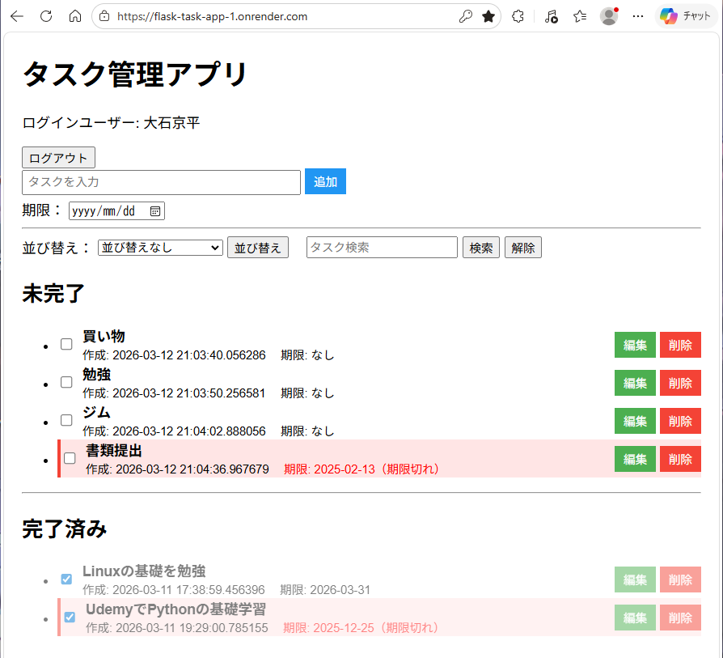
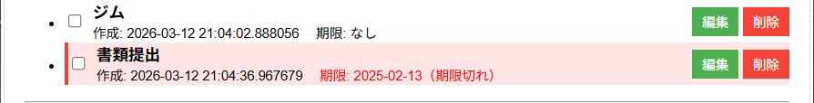
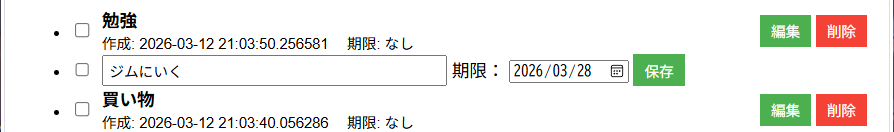

# Task Management App

Flask + PostgreSQL を使用して開発したタスク管理Webアプリです。
ユーザーごとにタスクを管理でき、期限管理・検索・並び替えなどの機能を実装しています。

日常的なタスク管理を想定し、
「タスクの整理」「期限の把握」「進捗の可視化」を行えるアプリとして開発しました。

---
## アプリ画面

### タスク一覧

### 期限切れタスク表示
期限が過ぎたタスクは赤色で表示されます。

### タスク編集
タスクのタイトルや期限を編集できます。

---

## 🌐 アプリURL
https://flask-task-app-j6za.onrender.com

---

## 主な機能

### 認証機能

* ユーザー登録
* ログイン / ログアウト

### タスク管理

* タスク追加
* タスク編集
* タスク削除
* タスク完了 / 未完了切り替え

### タスク管理補助機能

* 期限設定
* 期限切れタスクの赤表示
* タスク検索
* タスク並び替え

---

## 使用技術

### Backend

* Python
* Flask

### Database

* PostgreSQL

### Frontend

* HTML
* CSS
* Jinja2

### Deploy

* Render

---

## 技術選定理由

Pythonを学習する中でWebアプリケーションの仕組みを理解するため、
軽量でシンプルなWebフレームワークであるFlaskを採用しました。

Flaskはルーティングやテンプレート処理などWebアプリの基本構造を理解しやすく、
バックエンドの基礎を学ぶ目的に適していると考えました。

データベースには実務でも広く利用されているPostgreSQLを使用し、
クラウド環境へのデプロイを想定した構成にしています。

---

## 工夫した点

* ユーザーごとにタスクを管理できるよう認証機能を実装
* 期限切れタスクを赤表示することで視覚的に分かりやすく改善
* タスク検索と並び替え機能を追加し、タスク管理の利便性を向上

---

## 開発で苦労した点

### Renderでのデプロイ

ローカル環境ではSQLiteを使用していましたが、
クラウド環境での運用を想定しPostgreSQLへ変更しました。

Renderでのデプロイ時には

* 環境変数の設定
* データベース接続設定
* requirements.txtの整理

などを行い、オンライン上でアプリが動作するように構成を調整しました。

---

### UIのレイアウト調整

タスク一覧画面では

* チェックボックス
* タスク内容
* 編集 / 削除ボタン

の位置関係を調整し、視認性と操作性を改善しました。

HTMLテンプレートとCSSを調整しながら
「タスク管理が直感的に行えるUI」を意識してレイアウトを設計しました。

---

## 今後追加予定

* タスク優先度機能
* UI / UX改善
* レスポンシブ対応
* タグ機能

## 🛠 トラブルシューティング

### ■ RenderのPostgreSQL無料プランの期限切れ

開発中に、Renderの無料PostgreSQLデータベースの試用期間が終了し、データベースが停止する問題が発生しました。

#### 発生したエラー
- psycopg2.OperationalError
- could not translate host name to address
- サービスが「suspended」状態になる

#### 原因
- 無料プランの有効期限切れ
- External Database URLを使用していたことによる接続失敗

#### 対応
- 新しいPostgreSQLデータベースを作成
- Internal Database URLを使用するように変更
- RenderのEnvironment VariablesにDATABASE_URLを設定
- アプリ起動時にinit_db()でテーブルを自動作成

#### 学び
- クラウド環境では内部接続用URL（Internal）と外部接続用URL（External）の違いを理解することが重要
- 環境変数で接続先を管理することで柔軟な対応が可能になる
- 本トラブルを通して、クラウド環境におけるインフラとアプリケーションの関係性への理解を深めました。
